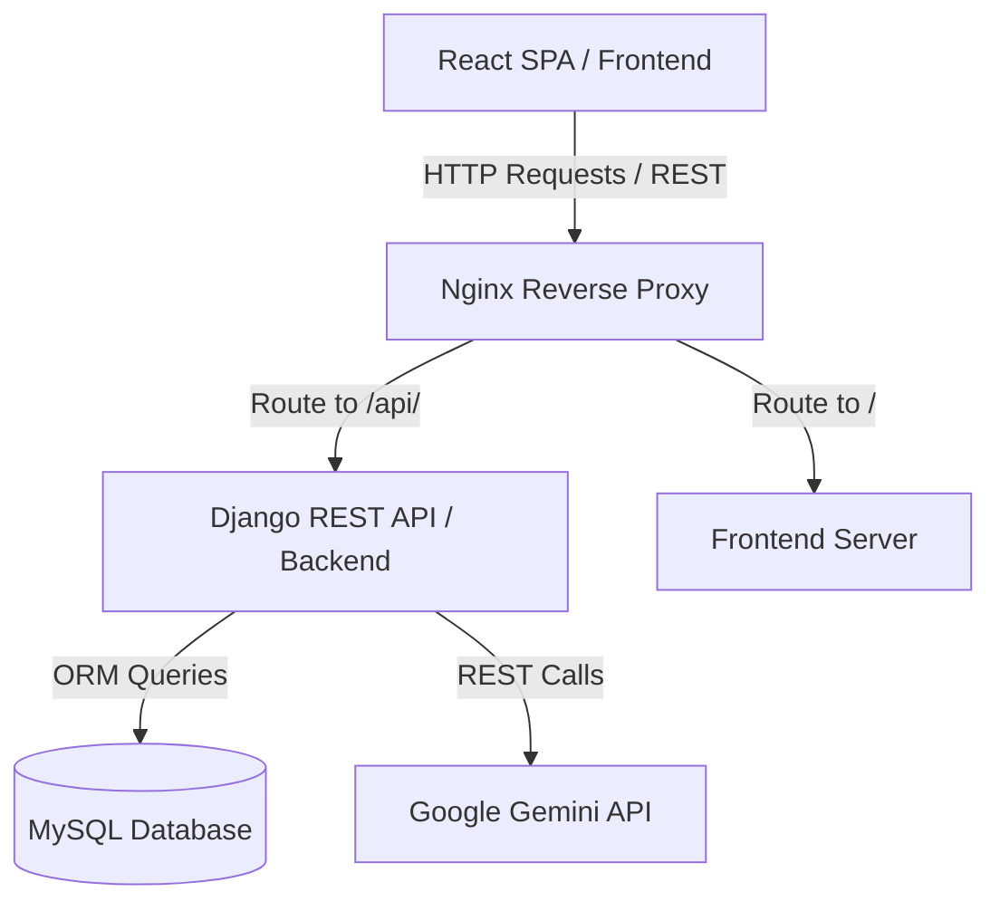

# GCJ Official Website Monorepo Architecture

This document outlines the architecture, data flows, and design patterns utilized in the GCJ Official Website.

---

## 🗺️ Architectural System Overview

The application follows a standard decoupled monorepo architecture:

### Components

1. **Client Interface (React + Vite)**
   - Single Page Application (SPA).
   - Component state managed locally with React Hooks and context.
   - Elegant, animated styling using Framer Motion and Tailwind CSS.
   - Connected to Backend via Axios.

2. **Web Gateway (Nginx)**
   - Acts as reverse proxy, routing requests to the frontend and backend services.
   - Enforces security limits and CORS policy configurations.
   - Serves built static assets directly in production.

3. **Backend Service (Django 5.x + DRF)**
   - Exposes RESTful JSON endpoints.
   - Implements SimpleJWT for token-based user authentication.
   - Leverages Django ORM for relational tables mapping.

4. **AI integration**
   - Direct integration using `google-generativeai` SDK.
   - Pre-configured system instructions enforce behavioral rules.

---

## 🔒 Security Configuration

- **Authentication**: JWT token storage inside HTTPOnly cookies or Secure LocalStorage. Tokens expire in 15 minutes (Access) and 7 days (Refresh).
- **CORS Policies**: Enforced at the Django level via `django-cors-headers` and Nginx rules.
- **Environment Isolation**: Configured using standard `.env` patterns, isolated inside containers.
